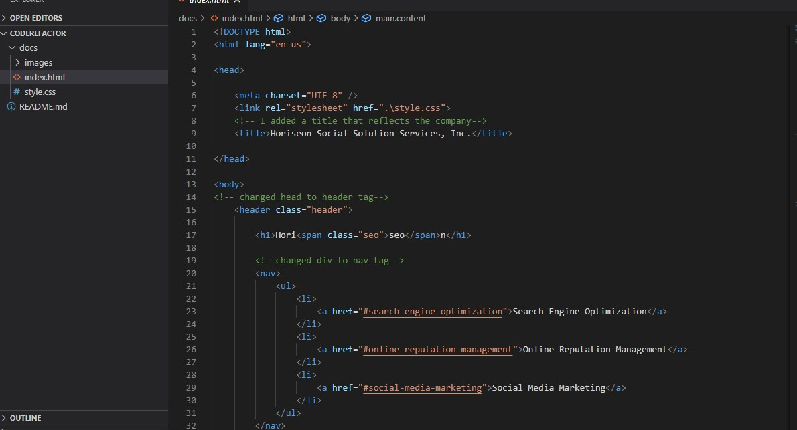
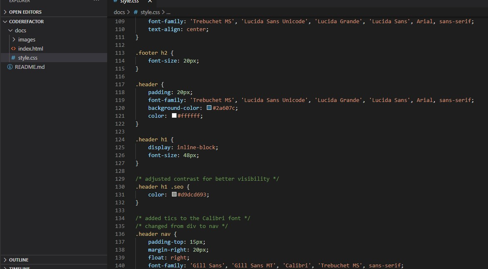

# CodeRefactor

## This is my first homework assignment for my coding bootcamp through KU. 

### We were given existing code and instructed to refactor it. 

** Specifically we are to: **

    : organze the html and css semantically
    : check for and correct any mistakes in the html and css
    : comment out the css file so it can be easily deciphered
    : ensure all links work propery and have correct alt tags
    : application deploys to a live url
    : application loads with no errors
    : github url is submitted
    : github repo contains application code
    : repo is named correctly
    : repo follows best practices for structure and naming conventions
    : repo has multiple descriptive commit messages 
    : repo contains quality README with screenshot and deployment link
    

